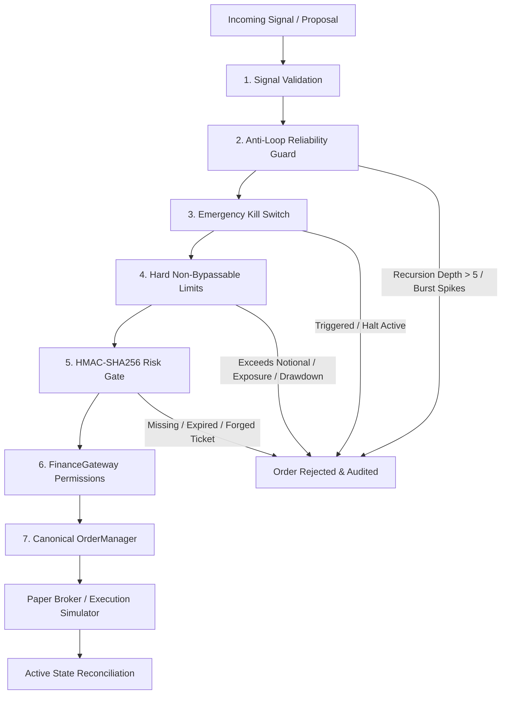

# Finance Agent OS — Autonomous Multi-Agent Trading Platform

[](https://github.com/namana843-bit/finance-agent-os/actions/workflows/ci.yml)
[](LICENSE)

An event-driven autonomous financial operating system powered by specialized collaborating trading agents (`Supervisor` → `Market` → `Quant` → `Risk` → `Portfolio` → `Execution`) with SSE Event API and Electron/React Desktop Dashboard.

## 🏛️ System Architecture

```
                                     User
                                      │
                      Desktop OS (Vite + React 18 + Electron)
             ┌────────────────────────┼────────────────────────┐
             │                        │                        │
      Trading Desk UI         Multi-Agent Rooms       Live Telemetry & Signals
     (AlphaQuant, Risk,     (Live Trading Floor,      (Orderbook, VaR, TWAP,
      ExecRouter, Intel)       Alpha Lab, Risk)        PnL & Active Alphas)
             │                        │                        │
             └────────────────────────┼────────────────────────┘
                                      │  HTTP REST / SSE Stream
                                      ▼
                             Fastify Server (:4132)
                                      │
                     FinanceRuntime (@finance/core)
      ┌───────────────────────────────┼───────────────────────────────┐
      │                               │                               │
TRADING AGENTS                     TOOLS                         SERVICES
  • Supervisor (Coordinator)       • Market Depth / OHLCV        • FinanceGateway
  • AlphaQuant (Quant/Signals)     • Volatility Surface / RSI    • OrderManager (Canonical Lifecycle)
  • RiskSentinel (VaR/Drawdown)    • Portfolio Margin / Risk     • PaperBroker (Risk-Gated)
  • ExecRouter (TWAP/Slippage)     • Strategy Backtesting (21+)  • BinanceRuntime (Read-Only)
  • MarketIntel (Order Flow/CVD)   • Exchange Providers          • ExecutionSimulator (Slippage/Fees)
  • PortfolioLead (NAV/Rebalance)  • Memory Traces (Sanitized)   • ExecutionPipeline
      │                               │                               │
      └───────────────────────────────┼───────────────────────────────┘
                                      ▼
                    TypedEventBus (Event-Driven Backbone)
                                      │
                             Execution Pipeline
      ┌───────────────────────────────────────────────────────────────┐
      │  1. Signal Validation (Schema & Numeric Parameter Verification)│
      │  2. Anti-Loop Reliability Guard (Recursion & Burst Cooldown)   │
      │  3. Emergency Kill Switch Gate (Circuit Breaker Check)        │
      │  4. Hard Non-Bypassable Limits (Notional, Exposure, Drawdown) │
      │  5. Cryptographic Risk Gate (HMAC-SHA256 RiskApprovalTicket)   │
      │  6. Permission & Rate Limiter (FinanceGateway)                │
      │  7. Canonical Order Manager (Terminal States, Persistence)    │
      └───────────────────────────────┬───────────────────────────────┘
                                      │
                        ┌─────────────┴─────────────┐
                        ▼                           ▼
                   PAPER BROKER             LIVE BROKER (Gated)
             (Enforces HMAC Ticket)        (Strict Read-Only Binance Runtime)
                        │                           │
                        ▼                           ▼
                 Paper Portfolio            Exchange Liquidity
                        ▲                           │
                        └───── Drift Reconciliation ┘
```

---

## 🛡️ Production Safety & Execution Pipeline

The execution architecture enforces 7 defense-in-depth safety layers before any trade execution:



1. **Signal Validation**: Validates symbol format, side (`buy`/`sell`), positive numeric price/quantity, and requiring `agentId`. Rejects free-form unstructured conversational text lacking quantitative parameters.
2. **Anti-Loop Reliability Guard** (`LoopGuard`): Enforces max recursion depth (`<= 5`), per-symbol cooldowns, duplicate event suppression via payload hashing, and retry tracking.
3. **Emergency Kill Switch** (`KillSwitch`): Instant trading halt that immediately cancels all open orders across `OrderManager` and `PaperBroker`, emits `audit.kill_switch_activated`, and requires administrative credentials to re-arm.
4. **Hard Non-Bypassable Limits** (`HardLimitsValidator`): Strict ceilings on single-order notional, symbol position notional, gross portfolio exposure, daily loss drawdown, concurrent open orders, and shorting.
5. **Cryptographic Risk Gate** (`ticket.ts`): HMAC-SHA256 signed `RiskApprovalTicket` with symbol/side/quantity/price payload binding, strict TTL expiration (default: 30s), and replay-prevention tracking.
6. **Canonical Order Lifecycle** (`OrderManager`): Monotonic state machine (`CREATED` → `PENDING` → `SUBMITTED` → `PARTIALLY_FILLED` → `FILLED`), terminal state protection (`FILLED`, `CANCELLED`, `REJECTED`, `FAILED`), and SQLite/in-memory persistence.
7. **Exchange State Reconciliation** (`ExchangeReconciliation`): Periodic and on-demand detection of position mismatches, phantom exchange orders, and stale internal orders with automated mitigation and kill-switch escalation.

---

## 🤖 Specialized Autonomous Trading Agents

| Agent | Role | Capabilities |
| :--- | :--- | :--- |
| **`Supervisor`** | System Orchestrator & Coordinator | Multi-agent task planning, trade proposal validation, loop guard enforcement, execution routing |
| **`AlphaQuant`** | Quantitative & Strategy Lead | RSI momentum, EMA/MACD crossovers, Bollinger squeeze, statistical arbitrage, expected returns |
| **`RiskSentinel`** | Risk & Compliance Guardian | 99% Value-at-Risk (VaR), portfolio margin limits, maximum drawdown caps, HMAC ticket issuance |
| **`ExecRouter`** | Smart Order Execution Desk | TWAP/VWAP order slicing, exchange liquidity routing, slippage and spread minimization |
| **`MarketIntel`** | Market Microstructure & Flow | Public stream monitoring, orderbook depth scanning, whale absorption alerts, volume delta |
| **`PortfolioLead`** | Portfolio Orchestrator & NAV | Capital allocation, multi-asset rebalancing, performance tracking, institutional metrics |

---

## 🔬 Trustworthy Backtesting Engine

- **Strict Zero Look-Ahead Bias**: Bar-by-bar sequential chronological iteration. Historical observation windows strictly end at current bar $i$.
- **Subsequent Bar Execution**: Supports `next_bar_open` (orders execute on the open of the bar following signal generation) and `current_bar_close`.
- **Realistic Execution Simulator**:
  - Configurable slippage (bps) and bid/ask spread (bps).
  - Maker vs. taker fee tiers.
  - Maximum volume participation limit (`maxVolumeParticipation: 0.10`).
  - Cash insolvency protection preventing negative portfolio balances.
  - Limit order crossing detection with price improvement modeling.
- **Institutional Financial Metrics**: Annualized Sharpe Ratio, Sortino Ratio (downside deviation), CAGR, Max Drawdown, Max Drawdown Duration, Win/Loss Rate, Profit Factor, Expectancy.

---

## 📁 Repository Structure

```
finance-agent-os/
├── apps/
│   ├── dashboard/                  # Desktop Application (React 18 + Vite + Electron)
│   │   ├── electron/               # Electron main & preload processes
│   │   ├── src/                    # Trading Desk UI, Agent Rooms, Live Telemetry
│   │   └── package.json
│   │
│   └── server/                     # Fastify API Server & Multi-Agent Runtime (:4132)
│       ├── __tests__/              # 18 Test Suites (266 passing unit & integration tests)
│       │   ├── live-safety.test.ts          # Phase 8: Hard limits, Kill Switch, Reconciliation
│       │   ├── backtesting-trustworthy.test.ts # Phase 7: Zero look-ahead bias, execution simulation
│       │   ├── binance-market.test.ts       # Phase 6: WebSocket streams, rate-limiting
│       │   ├── agent-loop.test.ts           # Phase 5: Anti-loop guard, proposals, sanitized memory
│       │   ├── risk-gate.test.ts            # Phase 4: HMAC risk tickets, broker boundary
│       │   ├── order-lifecycle.integration.test.ts # Phase 3: Canonical order state machine
│       │   └── ...                          # Paper broker, tools, runtime, supervisor tests
│       └── src/
│           ├── agents/             # Autonomous agent implementations (Supervisor, Quant, Risk, etc.)
│           ├── audit/              # Immutable audit logging with correlation IDs
│           ├── backtesting/        # Trustworthy backtesting engine, execution simulator, & metrics
│           │   ├── backtest-engine.ts       # Sequential zero look-ahead bar iterator
│           │   ├── execution-simulator.ts   # Slippage, spread, fees, volume limit, limit fills
│           │   └── metrics.ts               # Sharpe, Sortino, CAGR, Drawdown, Profit Factor
│           ├── broker/             # Paper broker simulation with position & PnL accounting
│           ├── core/               # LoopGuard, server factory, runtime composition
│           ├── environment/        # Market, portfolio, and paper trading adapters
│           ├── execution-pipeline/ # 7-stage gated execution pipeline (Signal → Risk → Safety → Broker)
│           ├── gateway/            # FinanceGateway permissions, rate limits, & symbol allowlists
│           ├── market/             # Binance live market runtime (read-only streams, REST rate limits)
│           │   ├── binance-rest.ts          # Read-only REST client with used-weight-1m tracking
│           │   ├── binance-ws.ts            # Multiplexed WebSocket client with reconnect/keepalive
│           │   ├── normalizer.ts            # Canonical market stream data normalizer
│           │   └── market-state.ts          # Real-time ticks, orderbook, and kline cache
│           ├── memory/             # AgentMemory with secret redaction and trace logging
│           ├── order-manager/      # Canonical OrderManager (monotonic state transitions, persistence)
│           ├── risk-engine/        # Cryptographic HMAC-SHA256 RiskApprovalTicket generator
│           ├── safety/             # Production live trading safety module
│           │   ├── hard-limits.ts           # Hard non-bypassable order, symbol, & portfolio limits
│           │   ├── kill-switch.ts           # Emergency circuit breaker & open order cancellation
│           │   ├── exchange-reconciliation.ts # Position/order drift detection & auto-mitigation
│           │   └── lifecycle-manager.ts     # Safe startup, order draining, & graceful shutdown
│           └── strategies/         # Pluggable quantitative strategy registry (EMA, RSI, MACD, etc.)
│
├── packages/
│   ├── core/                       # Autonomous Multi-Agent Engine & TypedEventBus
│   └── shared/                     # Domain types, event schemas, & cryptographic interfaces
│
├── prisma/                         # Database schema & migrations
└── scripts/
    ├── openbot.js                  # Interactive CLI terminal agent
    └── verify-honesty.mjs
```

---

## 🚀 Quick Start

### 1. Installation
```bash
pnpm install
```

### 2. Build All Packages
```bash
pnpm build
```

### 3. Development
```bash
# Start both Backend API Server and Desktop UI in parallel:
pnpm dev

# Or start individually:
pnpm dev:server       # Fastify backend on http://localhost:4132
pnpm dev:desktop      # Vite Desktop UI on http://localhost:5173
```

### 4. Run Native Desktop Window (Electron)
```bash
pnpm desktop:electron
```

### 5. Typecheck & Tests
```bash
pnpm typecheck        # Run TypeScript typechecks across all 5 workspace projects
pnpm test             # Run all 266 unit & integration tests across 18 test suites
```

---

## 🔒 License
MIT © Finance Agent OS
