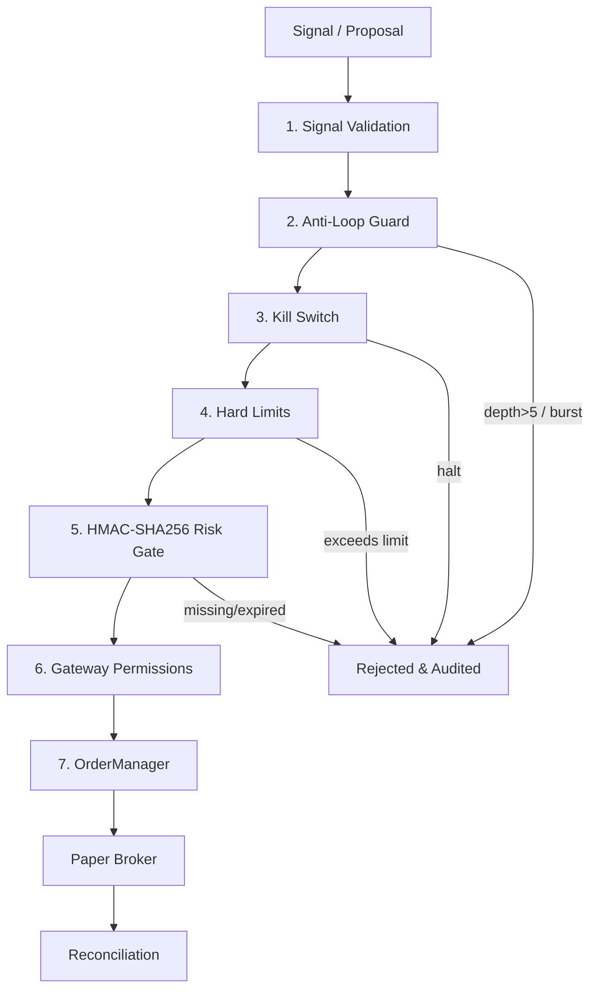

# Finance Agent OS — Autonomous Multi-Agent Trading Platform

[](https://github.com/namana843-bit/finance-agent-os/actions/workflows/ci.yml)
[](LICENSE)

An event-driven autonomous financial operating system powered by specialized collaborating trading agents (`Supervisor` → `Market` → `Quant` → `Risk` → `Portfolio` → `Execution`) with SSE Event API and Electron/React Desktop Dashboard. Paper-only by default — live trading is gated behind `LIVE_TRADING_ENABLED` and HMAC approval tickets.

## ✨ Features

- **7 autonomous agents** communicating via `TypedEventBus` (`packages/core/src/event-bus.ts:1`) — registered in `apps/server/src/core/runtime.ts:253-264`
- **7-stage execution pipeline** — Signal Validation → LoopGuard → KillSwitch → HardLimits → Risk HMAC Ticket → Gateway → OrderManager → PaperBroker
- **Real backtesting** — zero look-ahead, `next_bar_open` execution, slippage/spread/fees, Sharpe/Sortino/CAGR/Drawdown/ProfitFactor
- **OpenCode multi-agent orchestration** — `opencode.json` defines a `finance-agent` orchestrator that delegates to 4 permissioned specialists
- **Markdown instruction system** — `AGENTS`, `SOUL`, `TOOLS`, `FINANCE_RULES`, `RISK_RULES`, `AGENT_LOOP`, `ROADMAP` specs drive agent behaviour
- **File-persisted Agent Memory** — no SQLite hang: `memory/agent-memory.json` + `traces.jsonl` (5MB rotate, TTL cleanup)
- **Desktop OS** — Vite + React 18 + Electron trading desk (alpha lab, risk, telemetry, orderbook, PnL)
- **Fastify SSE API** on `:4132` — 70 REST endpoints + event stream
- **23 registered finance tools** + 4 default strategies (EMA/RSI/MACD/Momentum)
- **Opencode CLI Gateway** — permissioned `opencode --version` path allowlist with `useShell=false`

## 🏛️ System Architecture

```
                                     User
                                      │
                       Desktop OS (Vite + React 18 + Electron)
             ┌────────────────────────┼────────────────────────┐
             │                        │                        │
      Trading Desk UI         Multi-Agent Rooms       Live Telemetry & Signals
     (AlphaQuant, Risk,     (Live Trading Floor,      (Orderbook, VaR, TWAP,
      ExecRouter, Intel)       Alpha Lab, Risk)        PnL & Active Alphas)
             │                        │                        │
             └────────────────────────┼────────────────────────┘
                                      │  HTTP REST / SSE Stream
                                      ▼
                             Fastify Server (:4132)
                                      │
                     FinanceRuntime (@finance/core)
      ┌───────────────────────────────┼───────────────────────────────┐
      │                               │                               │
 TRADING AGENTS                     TOOLS                         SERVICES
  • Supervisor (Coordinator)       • Market Depth / OHLCV        • FinanceGateway
  • AlphaQuant (Quant/Signals)     • Volatility Surface / RSI    • OrderManager (Canonical)
  • RiskSentinel (VaR/Drawdown)    • Portfolio Margin / Risk     • PaperBroker (Risk-Gated)
  • ExecRouter (TWAP/Slippage)     • Strategy Backtesting        • BinanceRuntime (Read-Only)
  • MarketIntel (Order Flow/CVD)   • Exchange Providers          • ExecutionSimulator
  • PortfolioLead (NAV/Rebalance)  • Memory Traces (Sanitized)   • ExecutionPipeline
      │                               │                               │
      └───────────────────────────────┼───────────────────────────────┘
                                      ▼
                    TypedEventBus (Event-Driven Backbone)
                                      │
                             Execution Pipeline
      ┌───────────────────────────────────────────────────────────────┐
      │  1. Signal Validation (Schema & Numeric Verification)          │
      │  2. Anti-Loop Guard (Recursion & Burst Cooldown)              │
      │  3. Emergency Kill Switch Gate (Circuit Breaker)              │
      │  4. Hard Non-Bypassable Limits (Notional, Exposure, Drawdown) │
      │  5. Cryptographic Risk Gate (HMAC-SHA256 Ticket)              │
      │  6. Permission & Rate Limiter (FinanceGateway)                │
      │  7. Canonical Order Manager (Terminal States, Persistence)    │
      └───────────────────────────────┬───────────────────────────────┘
                                      │
                        ┌─────────────┴─────────────┐
                        ▼                           ▼
                   PAPER BROKER             LIVE BROKER (Gated)
             (Enforces HMAC Ticket)        (Strict Read-Only Binance)
                        │                           │
                        ▼                           ▼
                 Paper Portfolio            Exchange Liquidity
                        ▲                           │
                        └───── Drift Reconciliation ┘
```

---

## 🛡️ Production Safety & Execution Pipeline



1. **Signal Validation** — symbol/side/price/quantity + `agentId`; planner `extractQuantity` strictly requires `qty:` or `<n> BTC|ETH|SOL`
2. **Anti-Loop Guard** (`LoopGuard`) — max depth 5, per-symbol cooldown, dedup via payload hash
3. **Emergency Kill Switch** (`KillSwitch`) — cancels all open orders, emits `audit.kill_switch_activated`, live mode requires `KILL_SWITCH_OVERRIDE_KEY`
4. **Hard Limits** — notional, exposure, drawdown, concurrent orders
5. **Risk Ticket** (`risk-engine/ticket.ts:39`) — HMAC-SHA256, TTL 30s, replay prevention
6. **OrderManager** — `CREATED→PENDING→SUBMITTED→PARTIALLY_FILLED→FILLED`, atomic `writeFileAtomic`, unified `DATA_DIR`
7. **Reconciliation** — phantom order / drift detection

---

## 🤖 Agents — Where is my AI agent?

All agents live in `apps/server/src/agents/` and are wired in `apps/server/src/core/runtime.ts:253-264`:

| Agent | Path | Role |
| :--- | :--- | :--- |
| **`Supervisor`** | `agents/supervisor/index.ts` | Orchestrator — planner `task → Market → Quant → Risk → Portfolio → Execution`, LoopGuard, proposal validation |
| **`Market`** | `agents/market/index.ts` | Binance REST/WS, OHLCV, orderbook, synthetic fallback |
| **`Quant`** | `agents/quant/index.ts` | RSI/EMA/MACD/Bollinger, strategy signals, expected returns |
| **`Risk`** | `agents/risk/index.ts` | VaR 99%, margin/drawdown, HMAC ticket issuance, kill-switch |
| **`Portfolio`** | `agents/portfolio/index.ts` | Balances, positions, NAV, rebalancing |
| **`Execution`** | `agents/execution/index.ts` | TWAP/VWAP slicing, PaperBroker orders, slippage |
| **`Demo`** | `agents/demo-agent/index.ts` | Demo/test agent |
| **LLM Bridge** | `llm/agent-runtime.ts` + `llm/engines.ts` + `llm/cli-session.ts` | `ProviderRegistry`/`EngineManager`/`CliSessionManager` for opencode `AgentRuntime` |

Talk to them: `SupervisorAgent.submitTask("buy 0.1 BTC if RSI <30")` → `bus.publish({type:"supervisor.task"})` → fan-out. Via HTTP: `POST /api/chat` or `POST /api/publish`.

## 🧭 OpenCode Multi-Agent Configuration

`opencode.json` defines the LLM-side agent topology used by this repository (distinct from the runtime agents above):

| Agent | Mode | Role |
| :--- | :--- | :--- |
| **`finance-agent`** | `primary` (default) | Orchestrator — decomposes the task, delegates to a specialist, validates the result, returns the final answer |
| **`market-research-agent`** | `subagent` | Markets, companies, sectors, macro research (`webfetch` only — no edit/shell) |
| **`btc-quant-agent`** | `subagent` | BTC quant research, indicators, backtests (`python *` shell allowed, everything else `ask`) |
| **`risk-guardian-agent`** | `subagent` | Independent risk review → returns exactly `PASS` / `FAIL` / `NEEDS_REVIEW` (fully sandboxed: no edit/shell/webfetch) |
| **`opencode-cli-agent`** | `subagent` | Repository engineering — inspect, edit, debug, run tests (`git push *` denied, other shells `ask`) |

Shared guardrails in every system prompt: paper trading by default, never bypass risk limits/kill switches, never invent market data or backtest results, prevent look-ahead bias, account for fees/slippage, protect secrets.

## 📚 Markdown Instruction System

Agent behaviour and platform policy are specified in versioned Markdown at the repo root and in `docs/`:

| Document | Purpose |
| :--- | :--- |
| `AGENTS.md` | Coding-agent operational instructions, architecture constraints, standards |
| `SOUL.md` | Agent identity, persona and behavioral principles |
| `TOOLS.md` | Catalog of all 23 callable finance tools with schemas and status |
| `FINANCE_RULES.md` | Data integrity, numeric precision, backtesting & evidence rules |
| `RISK_RULES.md` | Risk policies, circuit breakers, 7-stage pipeline (deterministic enforcement) |
| `docs/AGENT_LOOP.md` | Multi-turn reasoning & tool-calling loop (`AgentRuntime`) |
| `docs/ROADMAP.md` | 8-phase roadmap: Foundation → Data → Quant → Research → Backtesting → Portfolio → Paper → Live |
| `docs/ARCHITECTURE.md` · `docs/API.md` · `docs/EVENTS.md` · `docs/RISK.md` · `docs/SECURITY.md` · `docs/EXECUTION.md` · `docs/STRATEGIES.md` · `docs/RUNTIME.md` · `docs/DEVELOPMENT.md` | Detailed subsystem specs |

## 🧰 Tech Stack

| Layer | Tech |
| :--- | :--- |
| Runtime | Node 22, TypeScript 5.6, pnpm 9 workspaces |
| Server | Fastify 5 + `@fastify/cors`, `ws` 8, `uuid`, `tsx` watch |
| Core | `packages/core` `TypedEventBus` + `FinanceRuntime` + `BaseServiceWrapper` (`apps/server/src/core/service-wrapper.ts`) |
| Dashboard | React 18 + Vite + Electron, `shadcn/ui`, `lib/fetch.ts` (deduped `fetchJson`), `lib/clipboard.ts` |
| DB | Prisma 5 (slim 9 models) + SQLite `file:./dev.db` + file-persisted `AgentMemory` |
| Tests | Vitest 3 — 27 files / 351 tests (server) + 3 files (core) |

## 📁 Repository Structure

```
finance-agent-os/
├── apps/
│   ├── dashboard/                  # Desktop App (React 18 + Vite + Electron :5173)
│   │   ├── electron/               # main & preload
│   │   ├── src/Root.tsx            # hash router (/#/dashboard, /#/engines)
│   │   ├── src/app/engines/        # engines management page
│   │   ├── src/lib/{api,chat-api,llm-api,fetch,clipboard}.ts
│   │   └── src/components/ui/*     # shadcn/ui
│   └── server/                     # Fastify API (:4132) + Multi-Agent Runtime
│       ├── __tests__/              # 27 vitest suites (351 tests)
│       └── src/
│           ├── adapters/           # binance-ws adapter
│           ├── agents/             # supervisor/planner, quant, risk(VaR), portfolio, execution, market, demo
│           ├── approvals/          # approval service (order/proposal gates)
│           ├── audit/              # immutable audit logs + correlation IDs
│           ├── backtesting/        # engine + execution-simulator + metrics (Sharpe/Sortino/CAGR/Drawdown)
│           ├── broker/             # PaperBroker
│           ├── chat/               # chat service, dialogue engine, bots-as-contacts
│           ├── core/               # LoopGuard, server, runtime, storage(DATA_DIR), service-wrapper
│           ├── environment/        # market/portfolio/paper adapters
│           ├── execution-pipeline/ # 7-stage gated pipeline
│           ├── gateway/            # FinanceGateway + OpencodeCliGateway (hardened) + OpencodeDaemon
│           ├── llm/                # AgentRuntime, providers, engines, registry, persistence(DATA_DIR)
│           ├── market/             # binance-rest/ws, normalizer, market-state
│           ├── memory/             # AgentMemory (file-persisted, sanitized)
│           ├── order-manager/      # OrderManager (writeFileAtomic + DATA_DIR)
│           ├── persistence/        # Prisma client
│           ├── plugins/            # binance-market plugin
│           ├── providers/          # market-data / memory providers
│           ├── risk-engine/        # HMAC ticket
│           ├── safety/             # hard-limits, kill-switch, reconciliation, lifecycle
│           ├── state/              # state recovery
│           ├── strategies/         # registry (EMA/RSI/MACD/Momentum)
│           ├── strategy-lab/       # idea → strategy → backtest → risk candidate workflow
│           ├── tools/              # 23 finance tools + indicators
│           ├── trade-engine/       # trade engine
│           └── utils/              # validation-helpers (asRecord/asString)
├── packages/
│   ├── core/                       # TypedEventBus, FinanceRuntime, BaseServiceWrapper
│   └── shared/                     # domain types, event schemas
├── docs/                           # subsystem specs (ARCHITECTURE, API, EVENTS, RISK, …)
├── prisma/                         # slim schema (9 models)
├── scripts/                        # verify-honesty.mjs + CLI scaffold
├── opencode.json                   # OpenCode multi-agent configuration
└── AGENTS/SOUL/TOOLS/FINANCE_RULES/RISK_RULES.md
```

---

## 🚀 Quick Start

### Prerequisites
- Node.js 22+, pnpm 9 (`npm i -g pnpm`), Windows/macOS/Linux

### 1. Install
```bash
pnpm install
```

### 2. Env
```bash
cp .env.example .env
# edit .env — see Environment table below
```

### 3. Build
```bash
pnpm build
# or pnpm --filter @finance/server build  # must be BUILD_OK
```

### 4. Dev
```bash
pnpm dev                    # server :4132 + dashboard :5173 in parallel
pnpm dev:server             # only Fastify on http://localhost:4132
pnpm dev:desktop            # only Vite on http://localhost:5173
pnpm desktop:electron       # native Electron window
```

### 5. Typecheck & Tests
```bash
pnpm typecheck              # tsc --noEmit across 4 workspaces
pnpm test                   # vitest run (server 351 tests + core)
```

---

## ⚙️ Environment

`.env.example` → `.env` (gitignored). Key vars:

| Var | Default | Notes |
| :--- | :--- | :--- |
| `PORT` | `4132` | Fastify port |
| `HOST` | `0.0.0.0` | bind host |
| `EXECUTION_MODE` | `paper` | `paper` (safe) / `live` (requires kill-switch key) |
| `FINANCE_DATA_DIR` | `~/.finance-agent` | unified `DATA_DIR` for orders/memory/agents/engines — `apps/server/src/config.ts:6` |
| `ALLOWED_ORIGINS` | `http://localhost:3000,http://localhost:5173` | CORS allowlist (no wildcard) — `core/server.ts:34` |
| `KILL_SWITCH_OVERRIDE_KEY` | *(none)* | **required in live mode**, ephemeral in paper — `safety/kill-switch.ts:76` |
| `DATABASE_URL` | `file:./dev.db` | no quotes, no `?connection_limit` — `prisma/schema.prisma` |
| `BINANCE_API_KEY/SECRET` | — | read-only market data |
| `BINANCE_WS_ENABLED` | `true` | live WS toggle |
| `OPENCODE_CLI_PATH` | — | opencode binary (auto-resolve via PATH + `PNPM_HOME` + `~/.opencode`) |
| `OPENCODE_GATEWAY_ENABLED` | `true` | opencode gateway toggle |

---

## 🔌 API Reference (Fastify `:4132`)

Base: `http://localhost:4132` — 70 REST routes + SSE.

| Method | Path | Description |
| :--- | :--- | :--- |
| `GET` | `/api/health` | health + version + runtime status |
| `GET` | `/api/agents` | list agents + status |
| `POST` | `/api/agents/:id/start` / `/stop` · `/api/agents/custom` | lifecycle + custom agent create |
| `GET`/`POST` | `/api/strategies` · `/api/strategies/:id/toggle` | registry |
| `GET` | `/api/signals?limit=&symbol=` | recent signals |
| `GET` | `/api/orders` / `/api/orders/:id` / `/api/orders/pending` | orders |
| `POST` | `/api/orders/propose` · `/api/orders/:id/cancel` `/approve` `/reject` | order actions |
| `GET`/`POST` | `/api/proposals` · `/api/proposals/:id/approve` `/reject` | trade proposals |
| `GET` | `/api/trades` | fills |
| `GET` | `/api/portfolio` + `/positions` `/history` `/allocation` | portfolio |
| `GET` | `/api/risk/status` `/metrics` | risk + VaR |
| `GET` | `/api/market/state` + `/api/market/candles` `/orderbook` `/ticks` | market |
| `POST` | `/api/trading/signal` · `/api/backtest/run` · `GET /api/backtest/strategies` | signals & backtests |
| `GET`/`POST` | `/api/threads` · `/api/threads/:id/messages` · `/api/bots` · `/api/bots/:id/engine` `/model` | chat rooms & bots |
| `POST` | `/api/publish` | publish bus event (**denylist**: `supervisor.`, `risk.`, `gateway.`, `order.`, `trade.proposal_`, `audit.kill_switch`, `opencode.`) → `403` — `core/server.ts:392` |
| `POST` | `/api/chat` + `GET /api/chat/history` | chat/dialogue |
| `GET` | `/api/audit` · `/api/execution/status` · `/api/state` | audit trail, pipeline status, state |
| `GET` | `/api/memory/stats` `traces` `entries` · `DELETE /api/memory` | AgentMemory (file-persisted) |
| `GET` | `/api/llm/engines` `/providers` `/providers/health` `/usage` `/models` `/tools` | LLM layer |
| `POST` | `/api/llm/engines/:id/cli` | engine CLI override |
| `GET`/`POST` | `/api/agent-runtime/agents` + `/:id` `export` `import` · `POST /api/agent-runtime/chat/stream` | agent CRUD + streaming chat |
| `GET` | `/api/gateway/stats` · `/api/gateways` · `POST /api/gateway/trade` | FinanceGateway |
| `GET` | `/api/opencode/cli-path` `/paths` `/gateway/stats` · `POST /api/opencode/run` | opencode gateway |
| `GET` | `/api/ollama/models` · `/.well-known/finance-agent/environment` | Ollama + environment discovery |
| `SSE` | `/api/events` (via `TypedEventBus`, filterable by `channelId`/`threadId`/`agentId`/`type`/`runId`) | real-time event stream |

Example:
```bash
curl http://localhost:4132/api/health
curl http://localhost:4132/api/agents
curl http://localhost:4132/api/memory/stats
curl "http://localhost:4132/api/memory/traces?symbol=BTCUSDT&limit=50"
curl -X POST http://localhost:4132/api/chat -H "Content-Type: application/json" -d '{"message":"analyze BTC risk"}'
```

## 🖥️ CLI

Server binary: `finance-agent` (`apps/server/package.json` `bin: finance-agent → dist/cli-entry.js`)

```bash
pnpm --filter @finance/server cli --help
node apps/server/dist/cli-entry.js help
pnpm --filter @finance/server cli status   # agents + services
pnpm --filter @finance/server cli add agent my-agent --template quant
```

## 💾 Unified Data Dir & Persistent Agent Memory

- **Single source**: `DATA_DIR = FINANCE_DATA_DIR || ~/.finance-agent` (`config.ts:6`). All services (`orders.json`, `memory/`, `agents.json`, `engines.json`) resolve under it — fixes `process.cwd()` divergence on Windows.
- **AgentMemory** (`memory/agent-memory.ts`, `import * as path` — ESM safe): debounced 3s snapshot `memory/agent-memory.json` + append-only `traces.jsonl` (5MB rotate), 60s TTL cleanup, secret redaction, `writeFileAtomic` + `renameWithRetry` (Windows `EBUSY` safe), wired via `core/runtime.ts` `AgentMemoryService`.
- **Prisma slim**: 9 models only (hot `Event/AuditLog/MarketCandle` → in-memory/JSONL to avoid WAL lock). Generate: `pnpm prisma generate && pnpm prisma db push`.

## 🔐 Security Hardening (Audit 2026-09)

- **CORS** (`core/server.ts:34`): `origin:true+credentials:true` → `ALLOWED_ORIGINS` allowlist callback (fixes wildcard CSRF)
- **/api/publish** (`core/server.ts:392`): denylist `supervisor.|risk.|gateway.|order.|trade.proposal_|audit.kill_switch|opencode.` → `403`
- **Opencode gateway** (`gateway/opencode-cli-gateway.ts`): extended metachars `; & | $ > < \ ( ) { } [ ] ! % * ? ~`, per-arg `safeArgRe`, `useShell=false` even for `npx` fallback
- **Kill-switch** (`safety/kill-switch.ts:76`): no `EMERGENCY_OVERRIDE_SECRET_DEFAULT`; live throws if missing
- **Persistence**: unified `DATA_DIR` + `writeFileAtomic` (`atomic.ts`) across `storage.ts`, `llm/persistence.ts`, `llm/engines.ts`, `order-manager.ts`
- **Secrets**: every memory/log payload passes `sanitizeSecrets()` — `/^(api[_-]?key|secret|token|password|credential)/i` → `[REDACTED]`

## 🔬 Backtesting

- Zero look-ahead (window ends at bar `i`), `next_bar_open` / `current_bar_close`
- Slippage (bps) + spread (bps) + maker/taker fees + `maxVolumeParticipation: 0.10` + cash insolvency guard
- Metrics: Sharpe, Sortino, CAGR, Max Drawdown (+ duration), Win/Loss, Profit Factor, Expectancy
- Guarded by `__tests__/backtesting-trustworthy.test.ts` (10 tests: no look-ahead, train/test separation, overfit detection)

Run via `StrategyLab` (`strategy-lab/service.ts`) or `POST /api/backtest/run`.

## 🧪 Testing & CI

```bash
pnpm typecheck
pnpm --filter @finance/server test        # vitest — 27 files, 351 tests
pnpm --filter @finance/core test          # event-bus, registries, runtime
node scripts/verify-honesty.mjs           # live honesty checks (server must be running)
```

Workflows (`.github/workflows/`):

| Workflow | Trigger | What it does |
| :--- | :--- | :--- |
| `ci.yml` | push/PR → `main` | `pnpm install --frozen-lockfile` → `build` → `tsc --noEmit` → `test` (Node 22) |
| `pages.yml` | push → `main` | builds dashboard, deploys to GitHub Pages |
| `release.yml` | tag `v*` | Electron desktop builds for Windows/macOS/Linux |

Recent work: [#26 Markdown instruction system](https://github.com/namana843-bit/finance-agent-os/pull/26) · [#27 OpenCode orchestrator config](https://github.com/namana843-bit/finance-agent-os/pull/27)

## 🔒 License
MIT © Finance Agent OS
