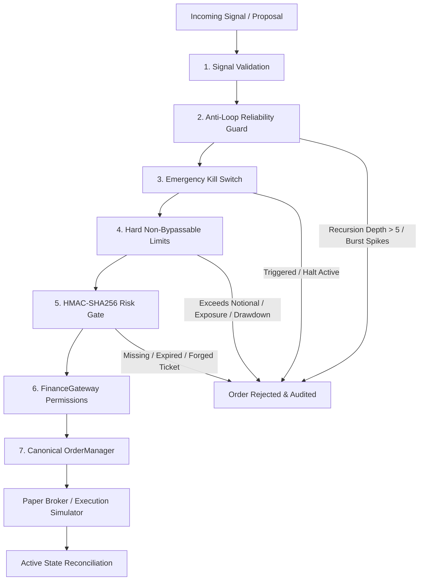

# Finance Agent OS — Autonomous Multi-Agent Trading Platform

[](https://github.com/namana843-bit/finance-agent-os/actions/workflows/ci.yml)
[](LICENSE)

An event-driven autonomous financial operating system powered by specialized collaborating trading agents (`Supervisor` → `Market` → `Quant` → `Risk` → `Portfolio` → `Execution`) with SSE Event API and Electron/React Desktop Dashboard.

## 🏛️ System Architecture

```
                                     User
                                      │
                      Desktop OS (Vite + React 18 + Electron)
             ┌────────────────────────┼────────────────────────┐
             │                        │                        │
      Trading Desk UI         Multi-Agent Rooms       Live Telemetry & Signals
     (AlphaQuant, Risk,     (Live Trading Floor,      (Orderbook, VaR, TWAP,
      ExecRouter, Intel)       Alpha Lab, Risk)        PnL & Active Alphas)
             │                        │                        │
             └────────────────────────┼────────────────────────┘
                                      │  HTTP REST / SSE Stream
                                      ▼
                             Fastify Server (:4132)
                                      │
                     FinanceRuntime (@finance/core)
      ┌───────────────────────────────┼───────────────────────────────┐
      │                               │                               │
TRADING AGENTS                     TOOLS                         SERVICES
  • Supervisor (Coordinator)       • Market Depth / OHLCV        • FinanceGateway
  • AlphaQuant (Quant/Signals)     • Volatility Surface / RSI    • OrderManager (Canonical Lifecycle)
  • RiskSentinel (VaR/Drawdown)    • Portfolio Margin / Risk     • PaperBroker (Risk-Gated)
  • ExecRouter (TWAP/Slippage)     • Strategy Backtesting (21+)  • BinanceRuntime (Read-Only)
  • MarketIntel (Order Flow/CVD)   • Exchange Providers          • ExecutionSimulator (Slippage/Fees)
  • PortfolioLead (NAV/Rebalance)  • Memory Traces (Sanitized)   • ExecutionPipeline
      │                               │                               │
      └───────────────────────────────┼───────────────────────────────┘
                                      ▼
                    TypedEventBus (Event-Driven Backbone)
                                      │
                             Execution Pipeline
      ┌───────────────────────────────────────────────────────────────┐
      │  1. Signal Validation (Schema & Numeric Parameter Verification)│
      │  2. Anti-Loop Reliability Guard (Recursion & Burst Cooldown)   │
      │  3. Emergency Kill Switch Gate (Circuit Breaker Check)        │
      │  4. Hard Non-Bypassable Limits (Notional, Exposure, Drawdown) │
      │  5. Cryptographic Risk Gate (HMAC-SHA256 RiskApprovalTicket)   │
      │  6. Permission & Rate Limiter (FinanceGateway)                │
      │  7. Canonical Order Manager (Terminal States, Persistence)    │
      └───────────────────────────────┬───────────────────────────────┘
                                      │
                        ┌─────────────┴─────────────┐
                        ▼                           ▼
                   PAPER BROKER             LIVE BROKER (Gated)
             (Enforces HMAC Ticket)        (Strict Read-Only Binance Runtime)
                        │                           │
                        ▼                           ▼
                 Paper Portfolio            Exchange Liquidity
                        ▲                           │
                        └───── Drift Reconciliation ┘
```

---

## 🛡️ Production Safety & Execution Pipeline

The execution architecture enforces 7 defense-in-depth safety layers before any trade execution:



1. **Signal Validation**: Validates symbol format, side (`buy`/`sell`), positive numeric price/quantity, and requiring `agentId`. Rejects free-form unstructured conversational text lacking quantitative parameters. Planner `extractQuantity` now strictly requires `qty:` or `<n> BTC|ETH|SOL` (prevents `buy BTC at 68234` price→qty confusion).
2. **Anti-Loop Reliability Guard** (`LoopGuard`): Enforces max recursion depth (`<= 5`), per-symbol cooldowns, duplicate event suppression via payload hashing, and retry tracking.
3. **Emergency Kill Switch** (`KillSwitch`): Instant trading halt that immediately cancels all open orders across `OrderManager` and `PaperBroker`, emits `audit.kill_switch_activated`, and requires administrative credentials to re-arm. No hardcoded default — `KILL_SWITCH_OVERRIDE_KEY` is **required in `live` mode** (paper mode uses ephemeral key + warn).
4. **Hard Non-Bypassable Limits** (`HardLimitsValidator`): Strict ceilings on single-order notional, symbol position notional, gross portfolio exposure, daily loss drawdown, concurrent open orders, and shorting.
5. **Cryptographic Risk Gate** (`ticket.ts`): HMAC-SHA256 signed `RiskApprovalTicket` with symbol/side/quantity/price payload binding, strict TTL expiration (default: 30s), and replay-prevention tracking.
6. **Canonical Order Lifecycle** (`OrderManager`): Monotonic state machine (`CREATED` → `PENDING` → `SUBMITTED` → `PARTIALLY_FILLED` → `FILLED`), terminal state protection (`FILLED`, `CANCELLED`, `REJECTED`, `FAILED`), and **atomic** file persistence via `writeFileAtomic` + unified `DATA_DIR`.
7. **Exchange State Reconciliation** (`ExchangeReconciliation`): Periodic and on-demand detection of position mismatches, phantom exchange orders, and stale internal orders with automated mitigation and kill-switch escalation.

---

## 🤖 Specialized Autonomous Trading Agents

| Agent | Role | Capabilities |
| :--- | :--- | :--- |
| **`Supervisor`** | System Orchestrator & Coordinator | Multi-agent task planning, trade proposal validation, loop guard enforcement, execution routing |
| **`AlphaQuant`** | Quantitative & Strategy Lead | RSI momentum, EMA/MACD crossovers, Bollinger squeeze, statistical arbitrage, expected returns |
| **`RiskSentinel`** | Risk & Compliance Guardian | 99% Value-at-Risk (VaR), portfolio margin limits, maximum drawdown caps, HMAC ticket issuance |
| **`ExecRouter`** | Smart Order Execution Desk | TWAP/VWAP order slicing, exchange liquidity routing, slippage and spread minimization |
| **`MarketIntel`** | Market Microstructure & Flow | Public stream monitoring, orderbook depth scanning, whale absorption alerts, volume delta |
| **`PortfolioLead`** | Portfolio Orchestrator & NAV | Capital allocation, multi-asset rebalancing, performance tracking, institutional metrics |

---

## 🔬 Trustworthy Backtesting Engine

- **Strict Zero Look-Ahead Bias**: Bar-by-bar sequential chronological iteration. Historical observation windows strictly end at current bar $i$.
- **Subsequent Bar Execution**: Supports `next_bar_open` (orders execute on the open of the bar following signal generation) and `current_bar_close`.
- **Realistic Execution Simulator**:
  - Configurable slippage (bps) and bid/ask spread (bps).
  - Maker vs. taker fee tiers.
  - Maximum volume participation limit (`maxVolumeParticipation: 0.10`).
  - Cash insolvency protection preventing negative portfolio balances.
  - Limit order crossing detection with price improvement modeling.
- **Institutional Financial Metrics**: Annualized Sharpe Ratio, Sortino Ratio (downside deviation), CAGR, Max Drawdown, Max Drawdown Duration, Win/Loss Rate, Profit Factor, Expectancy.

---

## 🔐 Security Hardening (Audit — 2026-09)

- **CORS** (`core/server.ts:34`): `origin:true + credentials:true` replaced with `ALLOWED_ORIGINS` allowlist callback — fixes wildcard CSRF.
- **Event injection** (`core/server.ts:389` `POST /api/publish`): denylist `supervisor.|risk.|gateway.|order.|trade.proposal_|audit.kill_switch|opencode.` → `403` (prevents bypassing Risk/Gateway gates).
- **Opencode gateway** (`gateway/opencode-cli-gateway.ts:285`): extended shell metachars `; & | $ > < \ ( ) { } [ ] ! % * ? ~`, per-arg `safeArgRe` validation, `useShellForCli=false` even for `npx` fallback.
- **Kill-switch** (`safety/kill-switch.ts:75`): no hardcoded `EMERGENCY_OVERRIDE_SECRET_DEFAULT`; live mode throws if `KILL_SWITCH_OVERRIDE_KEY` missing.
- **Persistence**: unified `DATA_DIR` (`config.ts:6` → `~/.finance-agent` or `FINANCE_DATA_DIR`) used by `storage.ts:45`, `llm/persistence.ts:7`, `llm/engines.ts:220`, `core/runtime.ts:8` (`agent-memory`), `order-manager.ts:30`; `DATABASE_URL=file:./prisma/dev.db` without quotes/`?connection_limit=1`; atomic writes via `atomic.ts:28` `writeFileAtomic`.
- **Planner**: strict `extractQuantity` (`agents/supervisor/planner.ts:172`) — requires `qty:`/`quantity=` or `<n> BTC|ETH|SOL`; price no longer misparsed as quantity.

## 💾 Unified Data Dir & Persistent Agent Memory

- **Single source of truth**: `DATA_DIR = FINANCE_DATA_DIR || ~/.finance-agent` (`config.ts:6`). All services (orders, memory, agents, engines) resolve under it — no more divergences between `process.cwd()/.data`, `apps/server/.data`, and `~/.finance-agent` that lost files on restart/Windows.
- **AgentMemory** (`memory/agent-memory.ts:78`): file-persisted, **no SQLite hang** — debounced 3s snapshot `memory/agent-memory.json` + append-only `traces.jsonl` (5 MB rotate), 60 s TTL cleanup (7-day trace prune), secret redaction + `startAutoCleanup()`. Wired via `core/runtime.ts:143` `AgentMemoryService` and `core/server.ts:5` `/api/memory/{stats,traces,entries}` + `DELETE /api/memory`.
- **Prisma slim**: 9 models only (hot path `Event/AuditLog/MarketCandle/PortfolioSnapshot` moved to in-memory/JSONL to avoid WAL lock).

## 📁 Repository Structure

```
finance-agent-os/
├── apps/
│   ├── dashboard/                  # Desktop Application (React 18 + Vite + Electron)
│   │   ├── electron/               # Electron main & preload processes
│   │   ├── src/
│   │   │   ├── lib/fetch.ts            # Shared fetchJson (deduped from api/llm-api/chat-api)
│   │   │   ├── lib/clipboard.ts        # useClipboard hook (centralized)
│   │   │   ├── lib/utils.ts            # cn() helper
│   │   │   └── components/ui/*         # shadcn/ui primitives
│   │   └── package.json
│   │
│   └── server/                     # Fastify API Server & Multi-Agent Runtime (:4132)
│       ├── __tests__/              # Engine/agent/CLI/resolver tests
│       └── src/
│           ├── agents/             # Supervisor (planner), Quant, Risk (VaR), Portfolio, Execution, Market
│           ├── audit/              # Immutable audit logging with correlation IDs
│           ├── backtesting/        # backtest-engine, execution-simulator, metrics
│           ├── broker/             # Paper broker simulation
│           ├── core/               # LoopGuard, server factory, runtime, storage (DATA_DIR), service-wrapper
│           ├── environment/        # Market/portfolio/paper adapters
│           ├── execution-pipeline/ # 7-stage gated pipeline (Signal → Risk → Safety → Broker)
│           ├── gateway/            # FinanceGateway + OpencodeCliGateway (hardened) + OpencodeDaemon
│           ├── llm/                # ProviderRegistry, EngineManager, AgentRuntime, CliSession, persistence (DATA_DIR), engines (DATA_DIR)
│           ├── market/             # binance-rest/ws, normalizer, market-state
│           ├── memory/             # AgentMemory (file-persisted, sanitized traces)
│           ├── order-manager/      # Canonical OrderManager (writeFileAtomic + DATA_DIR)
│           ├── risk-engine/        # HMAC-SHA256 RiskApprovalTicket
│           ├── safety/             # hard-limits, kill-switch (no default secret), reconciliation
│           ├── strategies/         # Pluggable registry (EMA, RSI, MACD, etc.)
│           ├── tools/              # finance-tools, opencode, websearch + indicators
│           └── utils/              # validation-helpers (shared asRecord/asString)
│
├── packages/
│   ├── core/                       # TypedEventBus, FinanceRuntime, BaseServiceWrapper
│   └── shared/                     # Domain types, event schemas, crypto interfaces
│
├── prisma/                         # Slim schema (9 models) + migrations
└── scripts/
    └── (openbot scaffold via pnpm --filter @finance/server cli)
```

---

## 🚀 Quick Start

### 1. Installation
```bash
pnpm install
```

### 2. Build All Packages
```bash
pnpm build
```

### 3. Development
```bash
# Start both Backend API Server and Desktop UI in parallel:
pnpm dev

# Or start individually:
pnpm dev:server       # Fastify backend on http://localhost:4132
pnpm dev:desktop      # Vite Desktop UI on http://localhost:5173
```

### 4. Run Native Desktop Window (Electron)
```bash
pnpm desktop:electron
```

### 5. Typecheck & Tests
```bash
pnpm typecheck        # Run TypeScript typechecks across all 5 workspace projects
pnpm test             # Run all unit & integration tests (engine/agent/CLI/resolver)
pnpm --filter @finance/server build  # Verify server tsc (must be BUILD_OK)
```

### 6. Environment

Copy `.env.example` → `.env` (never commit `.env` — it is gitignored):

```bash
cp .env.example .env
# Required for live trading:
# KILL_SWITCH_OVERRIDE_KEY=<random 32+ chars>  # required when EXECUTION_MODE=live
# FINANCE_DATA_DIR=~/.finance-agent            # unified data dir (default)
# ALLOWED_ORIGINS=http://localhost:3000,http://localhost:5173  # CORS allowlist (no wildcard)
# DATABASE_URL=file:./prisma/dev.db           # no quotes, no ?connection_limit (SQLite)
```

### 7. Agent Memory API (file-persisted, no DB hang)

```bash
curl http://localhost:4132/api/memory/stats
curl "http://localhost:4132/api/memory/traces?symbol=BTCUSDT&limit=50"
curl "http://localhost:4132/api/memory/entries?agentId=supervisor&category=trade"
curl -X DELETE http://localhost:4132/api/memory
```

---

## 🔒 License
MIT © Finance Agent OS
