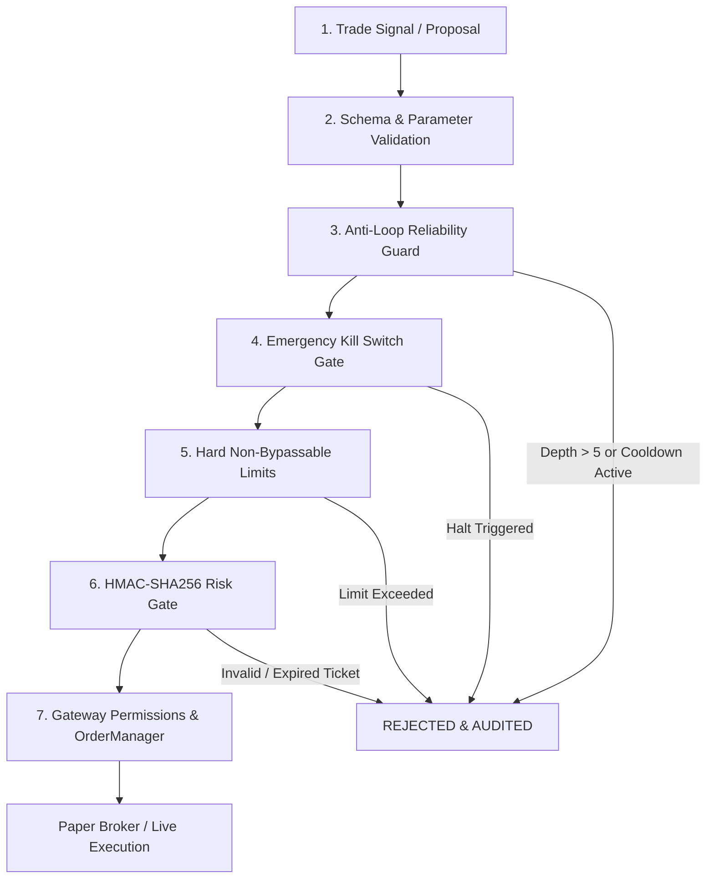

# Trading & Risk Policies (RISK_RULES)

> [!CRITICAL]
> **Risk enforcement cannot and must not rely on LLM prompts or agent reasoning.**
> LLMs and autonomous agents may generate hypotheses and trade proposals, but **all risk policies are enforced exclusively by deterministic, non-bypassable code and cryptographic primitives**.

This document outlines the mandatory risk parameters, circuit breakers, and execution boundaries enforced by **Finance Agent OS**.

---

## 1. The 7-Stage Execution Safety Pipeline

Every order request must pass sequentially through 7 programmatic gates before reaching a broker (`PaperBroker` or exchange):

### Stage 1: Schema & Parameter Validation
- Requires valid `symbol`, `side` (`buy` | `sell`), `quantity` (> 0), `price` (> 0), and originating `agentId`.
- Free-form text or unparsed natural language orders are rejected at the edge.

### Stage 2: Anti-Loop Reliability Guard (`LoopGuard`)
- **Max Recursion Depth**: Maximum 5 agent hops/iterations per event chain.
- **Cooldown Window**: 15,000 ms per-symbol cooldown between successive trades.
- **Duplicate Suppression**: Payload hashing prevents re-submission of identical orders within the cooldown window.

### Stage 3: Emergency Kill Switch (`KillSwitch`)
- State machine: `ARMED` vs `TRIGGERED` (halt).
- When triggered, all open orders in `OrderManager` and `PaperBroker` are cancelled immediately.
- Emits `audit.kill_switch_activated`.
- Re-arming requires explicit administrative authorization (`KILL_SWITCH_OVERRIDE_KEY`).

### Stage 4: Hard Non-Bypassable Limits (`HardLimitsValidator` & `RiskEngine`)
Deterministic thresholds applied to every evaluation:

| Risk Metric | Default Parameter | Hard Ceiling / Action |
| :--- | :--- | :--- |
| **Max Order Notional** | `$10,000` | Sliced or rejected if notional exceeds threshold |
| **Max Position Size** | `100 units` | Rejects order if new total exceeds max units |
| **Max Symbol Exposure** | `25%` of portfolio equity | Rejects if single asset exceeds 25% NAV |
| **Max Gross Exposure** | `80%` of portfolio equity | Rejects if aggregate positions exceed 80% NAV |
| **Max Open Positions** | `10 concurrent` | Rejects new symbol entry when at capacity |
| **Max Daily Loss** | `5%` of equity | Circuit breaker halts further buying for the day |
| **Max Portfolio Drawdown** | `15%` peak-to-trough | Circuit breaker triggers portfolio defensive mode |
| **Max Effective Leverage** | `3.0x` | Rejects order if margin requirements exceed cash |
| **Strategy Confidence** | `0.60` (60%) | Rejects proposals with low statistical confidence |
| **Mandatory Stop-Loss** | Configurable (`requireStopLoss`) | Rejects trade if stop-loss price is omitted |

### Stage 5: Cryptographic Risk Gate (`ticket.ts`)
- If all risk checks pass, `RiskEngine` issues an HMAC-SHA256 signed `RiskApprovalTicket`.
- **Payload Binding**: Ticket signature cryptographically binds `symbol`, `side`, `maxQuantity`, `maxPrice`, `agentId`, `strategy`, and `correlationId`.
- **Strict TTL Expiration**: Tickets expire after **30 seconds** (`expiresAt = timestamp + 30000`).
- **Single-Use Replay Prevention**: The broker marks the ticket's nonce as redeemed upon execution. A ticket cannot be reused.

### Stage 6: Finance Gateway Permissions (`FinanceGateway`)
- Checks agent-specific permissions (e.g. does `btc-quant-agent` have trade execution permission enabled in configuration?).
- Enforces symbol allowlists / blacklists.

### Stage 7: Canonical Order Manager (`OrderManager`)
- Enforces strict monotonic lifecycle state transitions:
  `CREATED` → `PENDING` → `SUBMITTED` → `PARTIALLY_FILLED` → `FILLED`.
- Terminal states (`FILLED`, `CANCELLED`, `REJECTED`, `FAILED`) are immutable.

---

## 2. Broker Boundary Enforcement

Neither `PaperBroker` nor any live exchange adapter will accept an order without:
1. An intact HMAC-SHA256 signature matching the shared risk secret.
2. Verification that `Date.now() <= ticket.expiresAt`.
3. Verification that `order.quantity <= ticket.maxQuantity` and `order.price <= ticket.maxPrice`.
4. Confirmation that the ticket has not been previously redeemed.

Attempts to submit orders that bypass this cryptographic boundary throw an uncatchable execution rejection and generate an immutable audit log entry.
