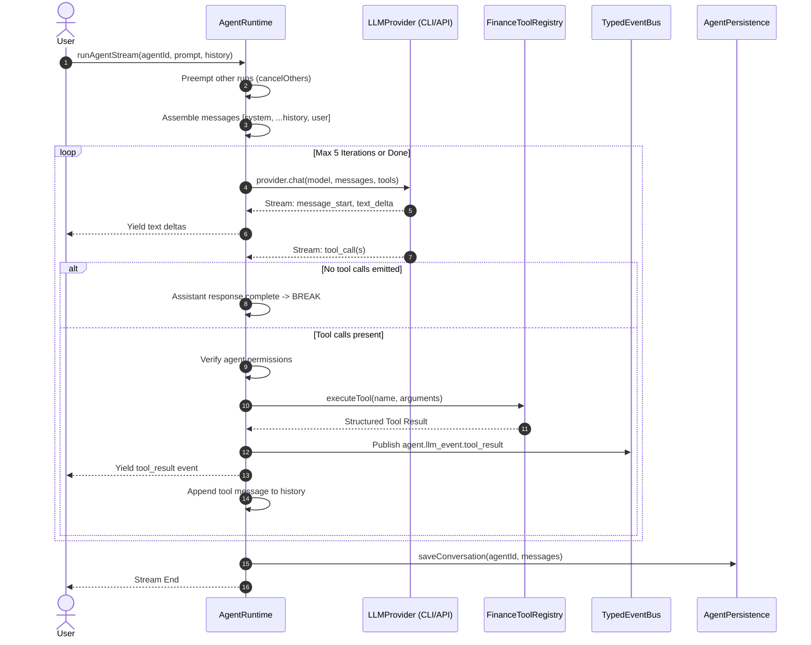

# Agent Reasoning & Tool-Calling Loop (AGENT_LOOP)

This document details the multi-turn reasoning and tool execution loop implemented in **Finance Agent OS** within `AgentRuntime` (`apps/server/src/llm/agent-runtime.ts`).

---

## 1. Loop Architecture Overview

The agent reasoning cycle is an asynchronous, event-driven multi-turn loop capable of streaming partial text, requesting tool executions, receiving structured tool outputs, and continuing its analysis until completion or a maximum iteration ceiling.



---

## 2. Step-by-Step Loop Mechanics

### A. Context Assembly
When an agent invocation begins:
1. **Config Resolution**: Retrieves the agent configuration (e.g., `btc-quant-agent`, `risk-guardian-agent`) from memory or disk.
2. **System Prompt Injection**: Prepends the agent's institutional persona, analytical responsibilities, and constraints.
3. **History Replay**: Appends persisted conversation history (`LLMMessage[]`).
4. **User Prompt**: Appends the latest user input.
5. **Tool Definition Binding**: If the underlying engine provider supports function calling, available tool definitions from `FinanceToolRegistry` are attached to the request.

### B. Preemption & Exclusive Execution Lock
To prevent competing agents from generating conflicting orders or corrupting shared runtime state:
- Starting a run calls `cancelOthers(agentId)`.
- In-flight tasks of all other agents are signaled via `AbortController.abort()`.
- Agents check `isAborted()` at each iteration boundary and before executing pending tool calls. If aborted, tool calls are marked `CANCELLED` and execution terminates immediately.

### C. Multi-Turn Tool Execution
The loop allows up to **5 sequential iterations** (`maxIterations = 5`):
1. **Stream Consumption**: Listens for `message_start`, `text_delta`, and `tool_call` events.
2. **Termination Condition**: If the model produces text without requesting tool calls (`pendingToolCalls.length === 0`), the turn is complete.
3. **Permission Check**: Before executing any tool, permissions are validated. For example, `create_trade_proposal` is rejected if `config.permissions.execution === false`.
4. **Parallel Tool Invocation**: If multiple tool calls are returned, they are dispatched concurrently via `Promise.all`:
   ```typescript
   result = await this.toolRegistry.executeTool(call.name, call.arguments);
   ```
5. **Event Emission**: Dispatches telemetry events to `TypedEventBus` (`agent.llm_event.tool_result`).
6. **Reinjection into Context**: The tool's output is formatted and pushed into the message array:
   ```typescript
   messages.push({
     role: "tool",
     toolCallId: call.id,
     name: call.name,
     content: typeof result === "string" ? result : JSON.stringify(result),
   });
   ```
7. The loop repeats with the updated message array, allowing the model to interpret the tool results and either formulate recommendations or invoke subsequent tools.

### D. Automatic History Persistence
Upon loop completion (or clean break), `saveConversationHistory` atomically saves the conversation messages to disk via `AgentPersistence`.

---

## 3. Integration with the Execution Pipeline

When an agent's reasoning loop determines that a trading opportunity exists:
1. The agent invokes `create_trade_proposal` or generates a structured `TradeProposal`.
2. The proposal is emitted onto `TypedEventBus`.
3. The proposal is intercepted by the **7-stage execution pipeline** (`apps/server/src/execution-pipeline/pipeline.ts`), where it is subjected to deterministic risk evaluation, HMAC ticket generation, and canonical order processing.
4. The agent **never** interacts directly with broker execution APIs.
