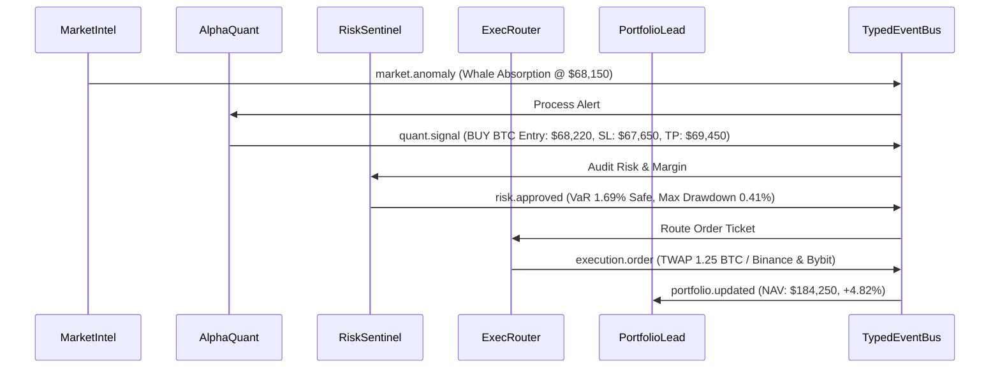

# Finance Agent OS — Architecture & Multi-Agent Design

**Platform:** Finance Agent OS  
**Version:** 1.0.0  
**Stack:** `@finance/core` + `@finance/shared` · Fastify (:4132) + TypedEventBus · Vite + React 18 + TailwindCSS + Electron Desktop

---

## 1. System Overview

Finance Agent OS is an event-driven, multi-agent autonomous financial platform with a pure desktop trading interface. The system orchestrates specialized AI agents that continuously monitor market data, formulate quantitative signals, enforce risk limits, execute paper/live trades, and rebalance portfolios.

---

## 2. Target Architecture

```
                                    User
                                     │
                     Desktop OS (Vite + React 18 + Electron)
            ┌────────────────────────┼────────────────────────┐
            │                        │                        │
     Trading Desk UI         Multi-Agent Rooms       Live Telemetry & Signals
    (AlphaQuant, Risk,     (Live Trading Floor,      (Orderbook, VaR, TWAP,
     ExecRouter, Intel)       Alpha Lab, Risk)        PnL & Active Alphas)
            │                        │                        │
            └────────────────────────┼────────────────────────┘
                                     │  HTTP REST / SSE Stream
                                     ▼
                            Fastify Server (:4132)
                                     │
                    FinanceRuntime (@finance/core)
     ┌───────────────────────────────┼───────────────────────────────┐
     │                               │                               │
TRADING AGENTS                     TOOLS                         SERVICES
  • AlphaQuant (Quant/Signals)     • Market Depth / OHLCV        • FinanceGateway
  • RiskSentinel (VaR/Drawdown)    • Volatility Surface / RSI    • AuditLogger
  • ExecRouter (TWAP/Slippage)     • Portfolio Margin / Risk     • PaperBroker
  • MarketIntel (Order Flow/CVD)   • Strategy Backtesting (21+)  • StrategyRegistry
  • PortfolioLead (NAV/Rebalance)  • Exchange Providers          • ExecutionPipeline
     │                               │                               │
     └───────────────────────────────┼───────────────────────────────┘
                                     ▼
                   TypedEventBus (Event-Driven Backbone)
                                     │
                            Execution Pipeline
                   (Signal → Risk → Permission → Paper)
                                     │
                                ┌────┴────┐
                                ▼         ▼
                             PAPER      LIVE BROKER (Gated)
                             BROKER       │
                                          ▼
                                   Exchange Liquidity
```

---

## 3. Specialized Autonomous Trading Agents

1. **`AlphaQuant` (Quantitative & Strategy Lead)**:
   - Evaluates multi-factor indicators (RSI, Bollinger Bands, MACD, Volume Delta).
   - Computes expected return, Sharpe ratio, and statistical arbitrage opportunities.
2. **`RiskSentinel` (Risk & Compliance Guardian)**:
   - Calculates 99% Value-at-Risk (VaR) and maximum drawdown limits.
   - Enforces collateral margins, liquidation distance, and per-symbol position caps.
3. **`ExecRouter` (Smart Execution Desk)**:
   - Slices orders into TWAP / VWAP execution batches.
   - Minimizes market impact and slippage across liquidity bridges.
4. **`MarketIntel` (Orderbook Microstructure & Flow)**:
   - Continuously scans orderbook depth, bid/ask imbalances, and whale absorption.
5. **`PortfolioLead` (Portfolio Allocator & NAV Orchestrator)**:
   - Tracks portfolio Net Asset Value (NAV), multi-asset weights, and PnL reconciliation.

---

## 4. Multi-Agent Collaborative Flow



---

## 5. Repository Structure

```
finance-agent-os/
├── apps/
│   ├── dashboard/              # 100% Pure Desktop Application
│   │   ├── electron/           # Electron main & preload processes
│   │   ├── src/                # Trading Agent UI, Multi-Agent Rooms, Telemetry Drawer
│   │   │   ├── App.tsx         # Main Trading Desk component
│   │   │   ├── index.css       # TailwindCSS styling & dark theme
│   │   │   ├── main.tsx        # React root mount
│   │   │   └── lib/api.ts      # Fastify API & SSE client
│   │   ├── index.html          # Desktop entry document
│   │   ├── tailwind.config.js
│   │   └── vite.config.ts      # Standalone Vite bundler (base: './')
│   │
│   └── server/                 # Fastify API & WebSocket Server (:4132)
│       └── src/
│           ├── agents/         # Base and specialized financial agent implementations
│           ├── chat/           # DialogueEngine (Multi-agent chat & event broadcast)
│           ├── core/           # Server factory & FinanceRuntime composition
│           ├── environment/    # FinanceEnvironment (Market, Portfolio, Paper adapters)
│           └── strategy-lab/   # Quantitative strategy backtester & factory
│
├── packages/
│   ├── core/                   # Autonomous Multi-Agent Engine & TypedEventBus
│   └── shared/                 # Domain types, event schemas, & data structures
│
├── prisma/                     # Database schema & migrations
└── scripts/
    ├── openbot.js              # Interactive CLI terminal agent
    └── verify-honesty.mjs
```

---

## 6. Execution Pipeline & Safety Gates

All trade actions must pass through strict execution stages:
1. **Signal Validation**: Payload schema & symbol validation via `@finance/shared`.
2. **Risk Check**: Real-time margin audit by `RiskSentinel`.
3. **Permission Gate**: Rate limiting, symbol allowlists, and volume caps enforced by `FinanceGateway`.
4. **Paper Broker Execution**: Simulated order fill and slippage calculation.
5. **Audit Trail**: Every step logged into `AuditLogger` with cryptographic correlation IDs.
